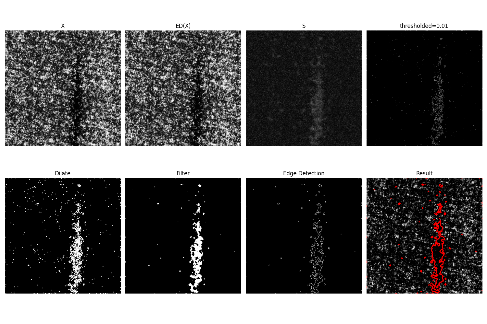

这里是《Textile defect detection algorithm based on unsupervised learning》的开源代码仓库

由于训练集较大，这里只提供源数据集下载地址：[DAGM](https://hci.iwr.uni-heidelberg.de/content/weakly-supervised-learning-industrial-optical-inspection),相关数据集修改文件见相关notebook。

网络训练命令:python main.py --train_dir Class6_dataset/train/normal/ --val_dir Class6_dataset/test/normal/

若想查看检测结果：直接运行test.py即可(相关运算结果如下)

